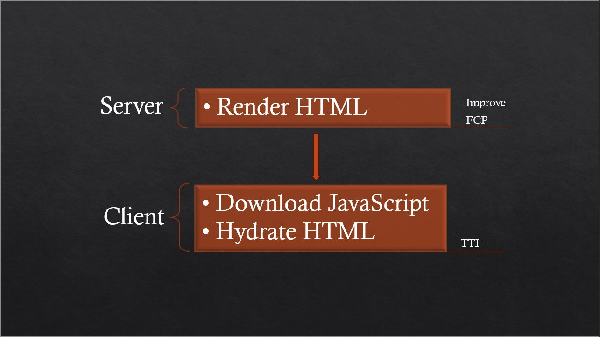

- [Overview of CSR](#overview-of-csr)
  - [Problems with CSR](#problems-with-csr)
- [Overview of SSR](#overview-of-ssr)
  - [SSR workflow](#ssr-workflow)
    - [SSR logic diagram](#ssr-logic-diagram)
- [React Server-Side Rendering Implementation](#react-server-side-rendering-implementation)
  - [Architecture Overview](#architecture-overview)
  - [Implementation Flow](#implementation-flow)

## Overview of CSR

In client side rendering, user would receive HTML file with empty root element and react JS bundles in script tag. React bundle inclues everything we need to mount DOM and run application, including third-party dependencies, and all of the code we have written. Once bundle is downloaded and parsed by browser, then react come into action generate DOM nodes for entire application and fill empty root element received in HTML file. Problem with this approach is that it takes time to do all that work. And while it's all happening user only see a blank white screen. This problem tends to get worse as we include new features in app. This adds more kelobytes to JS bundle, extending the amount of time that the user see white screen.

```html
<!DOCTYPE html>
<html>
  <body>
    <div id="root"></div>
    <script type="module" src="client/bundle.js"></script>
  </body>
</html>
```

### Problems with CSR

- It can impact SEO. Some search engine crawlers might not execute JS and therefore only see empty white page.
- It can also lead to performance issue for users with slower internet connections.
- Poor web vitals metrics

## Overview of SSR

We are designing SSR to improve above experiance. SSR lets you generate HTML from react components on there server, and send that HTML to your users. This lets users see the page's contant before your JS bundle loads and runs. That HTML file will still include the script tag, since we still need react to run on client, to handle any interactivity. But we configure React differently in browser: instead on generating entire DOM nodes, it attach interactivity logic to the existing HTML. This process also know as `hydration`.

```html
<!DOCTYPE html>
<html>
  <body>
    <div id="root"><div>Server Generated HTML</div></div>
    <script type="module" src="dist/client/bundle.js" crossorigine></script>
  </body>
</html>
```

### SSR workflow

SSR in React always happens in several steps:

1. User visits https://auth-ssr.com.
2. A Express.js server receives the request, render the entire app page to HTML and send it in the response.
3. Then, on the client, load the JavaScript code for the entire app.
4. Then, on the client, connect the JavaScript logic to the server-generated HTML for the entire app also know as "hydration".

   #### SSR logic diagram

   

## React Server-Side Rendering Implementation

This document explains how React Server-Side Rendering (SSR) is implemented in our Express application using React's `renderToPipeableStream` API.

### Architecture Overview

The SSR implementation consists of several key components:

1. Server Entry Point ([pages/root/entry-server.tsx](pages/root/entry-server.tsx))
2. SSR Functions:
   - [renderReact.js](src/react%20SSR%20functions/renderReact.js) - Main SSR controller
   - [renderDevelopment.js](src/react%20SSR%20functions/renderDevelopment.js) - Development mode renderer
   - [renderProduction.js](src/react%20SSR%20functions/renderProduction.js) - Production mode renderer
   - [steamComponents.js](src/react%20SSR%20functions/steamComponents.js) - Stream handling

### Implementation Flow

1. **Request Handling**
   The Express router ([src/routes/renderPages.js](src/routes/renderPages.js)) catches incoming requests and routes them to the appropriate renderer.

2. **Environment-Specific Rendering**

   - Development: Uses Vite's dev server for HMR and module loading
   - Production: Uses pre-built files for optimal performance

3. **Streaming Response**
   The application uses `renderToPipeableStream` for streaming HTML responses:

```tsx
// Entry point for SSR
export function render(url, ssrManifest, options) {
  return renderToPipeableStream(
    <StrictMode>
      <AllContextProvider>
        <StaticRouter location={url}>
          <App />
        </StaticRouter>
      </AllContextProvider>
    </StrictMode>,
    options
  );
}
```
